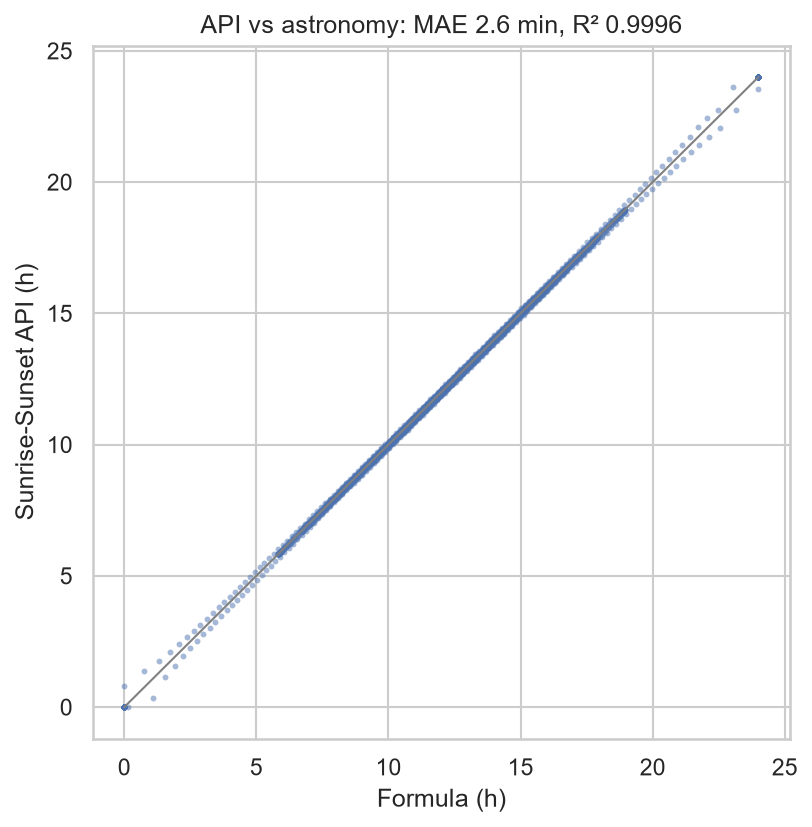
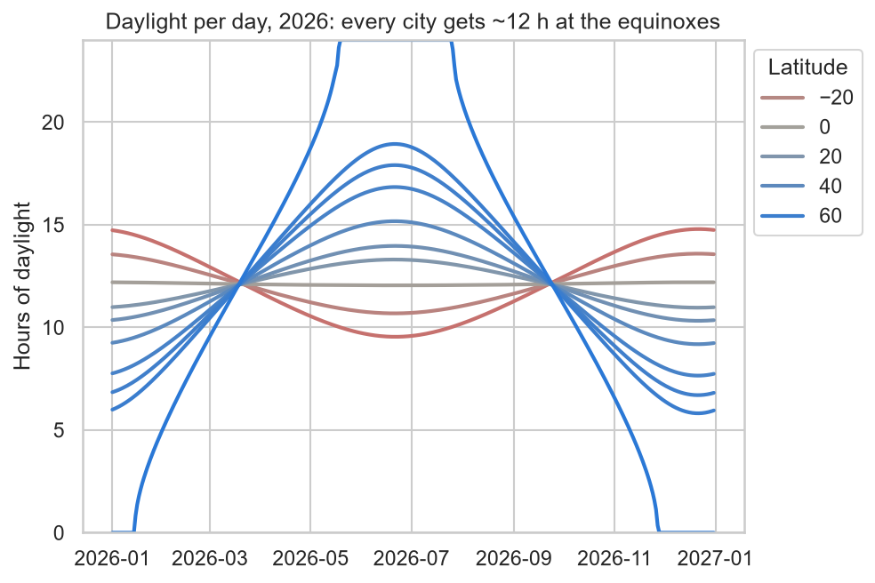
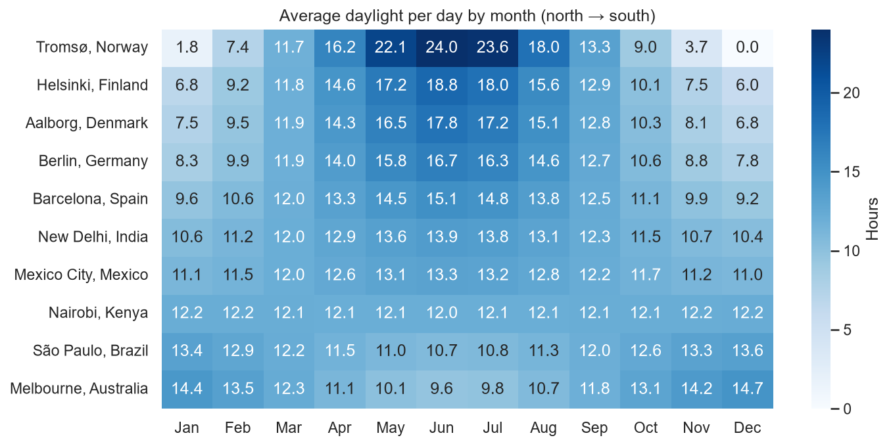

# 2 — Data

## The API

Sunrise-Sunset API v2: free, no key. We use one request per city per year:

```text
https://api.sunrise-sunset.org/v2?lat=57.0488&lng=9.9217&date_start=2026-01-01&date_end=2026-12-31
```

The response has a `days` list with 365 entries. We use two fields: `date`, and `day_length` in seconds (÷ 3600 = hours).

**Why v2 and not the `/json` endpoint from the brief:**
- `/json` reports Tromsø's **midnight sun as 0 hours**, the same as polar night. v2 correctly returns 86,400 s (24 h).
- `/json` quietly accepts nonsense such as `lat=999`. v2 returns HTTP 400 with a clear `message`, which the app shows.
- `/json` needs one request per day. v2 returns a whole year in one request.

**One quirk in v2:** in Tromsø on 16 May 2026 the sunset slips past midnight, so the API sends `day_length: null`. This is 1 day out of 3,650. `api.py` fills it in from the days on either side.

## Can we trust it?

We compared every city-day with the standard sunrise equation (`analysis/explore.py`, using scikit-learn metrics): **average error 2.6 minutes, R² 0.9996**. That's easily good enough to compare cities in hours.



## What the data shows



Every city gets about 12 hours at the equinoxes (around 20 March and 23 September). Further from the equator, the curve gets steeper. Southern cities (red) run opposite to northern ones (blue).



**Key numbers (2026, Aalborg as destination):**

| Home city | Gap on 21 Dec | Over the whole year |
|---|---:|---:|
| Berlin | −0 h 57 min | +19 h |
| Barcelona | **−2 h 29 min** | +46 h |
| New Delhi | −3 h 37 min | +63 h |
| Mexico City | −4 h 16 min | +70 h |
| Nairobi | −5 h 30 min | +81 h |
| São Paulo | −6 h 53 min | +85 h |
| Melbourne | −8 h 05 min | +83 h |

- Aalborg: shortest day **6 h 42 min** (21 Dec), longest **17 h 54 min** (21 Jun). Sunset on 21 Dec is **15:39** (from the API's sunset time).
- **The surprise:** every city averages 12.1–12.6 h of daylight a day over the year, and Aalborg actually gets *more* than Barcelona in total. Moving north doesn't take daylight away; it moves it from winter into summer. That's why the headline is the darkest day, not the yearly total.

## Limitation

The data is astronomical daylight under a clear sky, with no cloud cover. Northern winters are often overcast, so the real, felt gap is bigger than the chart shows.
